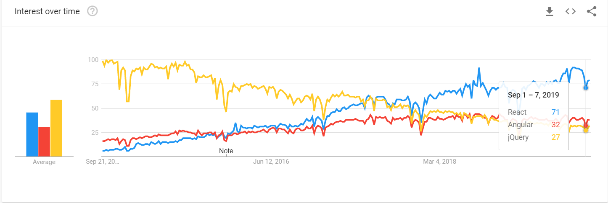

# jQuery vs. React vs. Angular

There are many front end web frameworks and libraries that developers use. Of all of them, you will typically hear about jQuery, [React](https://reactjs.org/) and [Angular](https://angular.io/) (and Vue). As you can see from the Google trends chart below, React and Angular have been getting increasingly popular over the past five years.

All of them are used to create front ends for your websites and apps. Let's get a little more specific, however, about the differences and similarities between the three of them:

## jQuery
jQuery is a Javascript library that adds some great syntactic sugar to your Javascript. This means that instead of having to type out long, arduous Javascript to change the DOM, you can write much more succinct code for the interactivity of your site. You can get started by simply including the jQuery CDN in your html. 

However, as time has gone on, React and Angular have become extremely popular due to their comprehensive approach to front end design. Other than adding some easy functionality and syntactic sugar to your Javascript, you are really just coding in plain Javascript and would add it to your website the same way as any other Javascript file.
## React
Developed by Facebook, React is much more of a library than a framework. The distinction is that you can plug React into any other framework (if you wanted to) and you would not have much of a problem. Frameworks on the other hand, such as Angular, dictate the structure of your app.

React is built on the idea of components - modularized parts of a website that are broken up in order to achieve a more organized code base. It is written in Javascript and JSX (Javascript that looks like HTML), so knowing HTML and Javascript will allow you to quickly pick up React.

React does not come with a Router out of the box, so you will typically want to use a third party router, such as Reach Router or React Router. 

## Angular
Angular is a full fledged framework that comes with a very comprehensive CLI. Angular takes control of how you structure your web app by creating a folder structure out of the bag, and you can use to CLI to quickly scaffold new components. 

Although Angular also works using components like React, Angular uses Typescript to write most of the programming logic. You then will write in html to develop your actual web pages. Angular comes with a router out of the bag, as well as an easy way to start styling your html with built in stylesheets within each component.

Angular's learning curve is much steeper than React's, but it is quite powerful.
#

## &nbsp;&nbsp;&nbsp;&nbsp;&nbsp;&nbsp;&nbsp;&nbsp;&nbsp;&nbsp;&nbsp;&nbsp;&nbsp;&nbsp;&nbsp;&nbsp;&nbsp;&nbsp;&nbsp;&nbsp;&nbsp;&nbsp;&nbsp;&nbsp;&nbsp;&nbsp;&nbsp;&nbsp;&nbsp;&nbsp;&nbsp;&nbsp;&nbsp;&nbsp;&nbsp;&nbsp;&nbsp;&nbsp;&nbsp;&nbsp;&nbsp;&nbsp;&nbsp;&nbsp;&nbsp;&nbsp;&nbsp;&nbsp;&nbsp;&nbsp;&nbsp;&nbsp;&nbsp;&nbsp;&nbsp;&nbsp;&nbsp;&nbsp;&nbsp;&nbsp;&nbsp;&nbsp;&nbsp;&nbsp;&nbsp;&nbsp;&nbsp;&nbsp;&nbsp;&nbsp;&nbsp;&nbsp;&nbsp;&nbsp;&nbsp;&nbsp;&nbsp;&nbsp;&nbsp;&nbsp;&nbsp;&nbsp;&nbsp;&nbsp;&nbsp;&nbsp;&nbsp; [Next](./002_React_Overview.md)
#
##  [Index](../../Index.md)