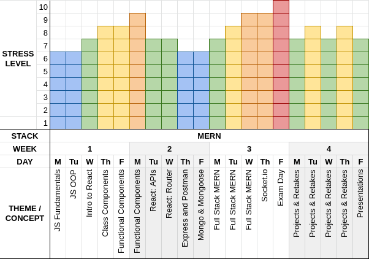

# Course Outline

Before you get started here is a quick note on how this curriculum has been laid out as well as a subjective gauge of how stressful each day is relative to the Belt Exam.

As you can see we will be spending the first few days getting reacquainted with the JavaScript programming language, familiarizing ourselves with handy features of its current incarnation __ES6__, and learning how __Object Oriented Programming__ works in JavaScript. Next we want to jump right into the good stuff (React). We want to prioritize the (in our opinion) trickiest part of the curriculum and familiarize ourselves with the three most important concepts of __React__ (Components, Props, and State). Once we have those mastered we need to be able to connect our Front-End with other apps, and we will begin making requests to __APIs__ using the __Axios__ library. After working exclusively on the Front-End for a week, we will need to turn our attention to the Back-End. Express will be the library we use here. We will then introduce a non-relational database in __MongoDB__ and use __Mongoose.js__ as our __ORM__. At this point we are ready to go __Full-MERN__ and will combine the React Apps we've been creating with our new-found __Express__ and __Mongoose__ knowledge. __Socket.io__ then will give us a nice, easy to work with library to make real-time asynchronous communication between our server and clients. We cover deployment as well and have plenty of time to prepare for the belt exam. The belt exam is undeniably a stressful day, but if you have used your time well you can and will be successful.

## Disclaimer:
This information above is all subject to change, delays, or possible rearrangement. Please check with your instructor if you want a more exact timeline. Also please don't interpret a lower stress day as being "better" to miss. Every day is critical for your understanding of MERN and preparation for the Belt Exam.
#
## [Previous](./001_React_Intro.md)&nbsp;&nbsp;&nbsp;&nbsp;&nbsp;&nbsp;&nbsp;&nbsp;&nbsp;&nbsp;&nbsp;&nbsp;&nbsp;&nbsp;&nbsp;&nbsp;&nbsp;&nbsp;&nbsp;&nbsp;&nbsp;&nbsp;&nbsp;&nbsp;&nbsp;&nbsp;&nbsp;&nbsp;&nbsp;&nbsp;&nbsp;&nbsp;&nbsp;&nbsp;&nbsp;&nbsp;&nbsp;&nbsp;&nbsp;&nbsp;&nbsp;&nbsp;&nbsp;&nbsp;&nbsp;&nbsp;&nbsp;&nbsp;&nbsp;&nbsp;&nbsp;&nbsp;&nbsp;&nbsp;&nbsp;&nbsp;&nbsp;&nbsp;&nbsp;&nbsp;&nbsp;&nbsp;&nbsp;&nbsp;&nbsp;&nbsp;&nbsp;&nbsp;&nbsp;&nbsp;&nbsp;&nbsp;&nbsp;&nbsp;&nbsp;&nbsp;&nbsp;&nbsp;&nbsp;&nbsp;&nbsp;&nbsp;&nbsp;&nbsp;&nbsp;&nbsp;&nbsp; [Next](./../003_Fundamentals/001_Javascritp_Overview.md)
#
##  [Index](../../Index.md)