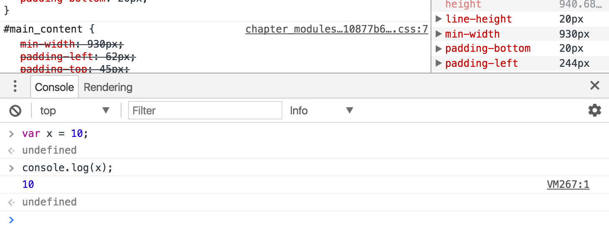

# Intro to Node
## Introduction to Node.js
Node.js is a powerful and flexible JavaScript interpreter, capable of letting us run JavaScript code free from our browser, using our computer's native hardware. Using __Chrome's V8 engine__, we can do everything from running JavaScript files directly from the terminal, to traversing local files, to even __spinning up a web server!__

## Let me Google that for you
## *A note before we get started:*
As you progress through the platform, you’ll be seeing snippets of code that will help you complete the assignments. However, you won’t get everything you need on the platform, and __that’s intentional__. A successful web developer must be able to solve problems with incomplete information. For early assignments, we’ll give you some hints as to what you might be missing. For the later challenges you’ll have to figure these unknown unknowns out for yourself. Embrace this – it’s integral to the art of programming.

# Installation
Before we jump into the nuances of JavaScript, we’re going to install Node. Doing this now will give you a couple of new powers as you code the early assignments:
1.  You can enter a JavaScript console without needing to open a browser.
2.  You can run JavaScript files in your terminal. That means you don’t have to write JavaScript in HTML `<script>` tags, which makes the development experience a little cleaner.

Installing software can be cumbersome, but the Node.js install should be pretty straightforward. If you are stuck for some reason, talk to a classmate who has the same type of OS as you.

First, visit [http://nodejs.org/](http://nodejs.org/) and download the 12.19.0 LTS installation. Once you’ve opened the file and completed the installation process, let’s check out our awesome new tool:

Using your terminal, check the version by typing:

```
node -v
```

This should print your current version, which should be at 12.18.3 LTS (long-term stable).

Let’s actually enter our own JavaScript environment and declare variables from the comfort of our own terminal.
```
node
```
You should have noticed your command prompt may have changed from `$` to `>`. That means whatever we write will be interpreted as JavaScript. (To exit this environment you can just type `ctrl C` twice or `.exit` once.)

Let’s write some code:
```js
console.log('hello');
```
Did you see the following output?
```
hello
undefined
```
Wahoo!

One additional note before we move ahead. We just typed `node` to enter a JavaScript environment, but what if we wanted the node to run a file full of code that we wrote in our text editor (which is a bit more efficient than writing directly in the console)? Just append your file name to the `node` command, like so: `node your_file_name.js`.

For macs: If the above commands didn’t work (especially `which node`), it’s probably your Mac trying to protect you. Use the following command to give yourself the ability to write files into `usr/local/`:

```
sudo chown -R $(whoami) /usr/local/
```
This will prompt you for your password. After you succeed, try reinstalling node!

To exit from node console, press Ctr+C or type .exit 

# Running JavaScript
## Interpreted Language
If you need to write and test just a few lines of JS without making a whole new file, then the browsers console is a good idea. This can be great for algorithm challenges! As there are multiple interpreters online, each will have its own interface, just make sure you have an area to write code and a console to read outputs.
## Browser Console
We can also run JS right out of the browser console. This can be useful for debugging, however it will only interpret JS one input at a time, rather than running an entire file.



## Other Resources
*   [JSFiddle](https://jsfiddle.net/)
*   [CodePen](http://codepen.io/)
*   [Python Tutor (has JS ES6 option)](http://pythontutor.com/visualize.html#mode=edit)
#
## [Previous](./../001_Overview/002_React_Overview.md)<span>&nbsp;&nbsp;&nbsp;&nbsp;&nbsp;&nbsp;&nbsp;&nbsp;&nbsp;&nbsp;&nbsp;&nbsp;&nbsp;&nbsp;&nbsp;&nbsp;&nbsp;&nbsp;&nbsp;&nbsp;&nbsp;&nbsp;&nbsp;&nbsp;&nbsp;&nbsp;&nbsp;&nbsp;&nbsp;&nbsp;&nbsp;&nbsp;&nbsp;&nbsp;&nbsp;&nbsp;&nbsp;&nbsp;&nbsp;&nbsp;&nbsp;&nbsp;&nbsp;&nbsp;&nbsp;&nbsp;&nbsp;&nbsp;&nbsp;&nbsp;&nbsp;&nbsp;&nbsp;&nbsp;&nbsp;&nbsp;&nbsp;&nbsp;&nbsp;&nbsp;&nbsp;&nbsp;&nbsp;&nbsp;&nbsp;&nbsp;&nbsp;&nbsp;&nbsp;&nbsp;&nbsp;&nbsp;&nbsp;&nbsp;&nbsp;&nbsp;&nbsp;&nbsp;&nbsp;&nbsp;&nbsp;&nbsp;&nbsp;&nbsp;&nbsp;&nbsp;&nbsp;</span> [Next](./../003_Fundamentals/001_Javascritp_Overview.md)
#
##  [Index](../../Index.md)