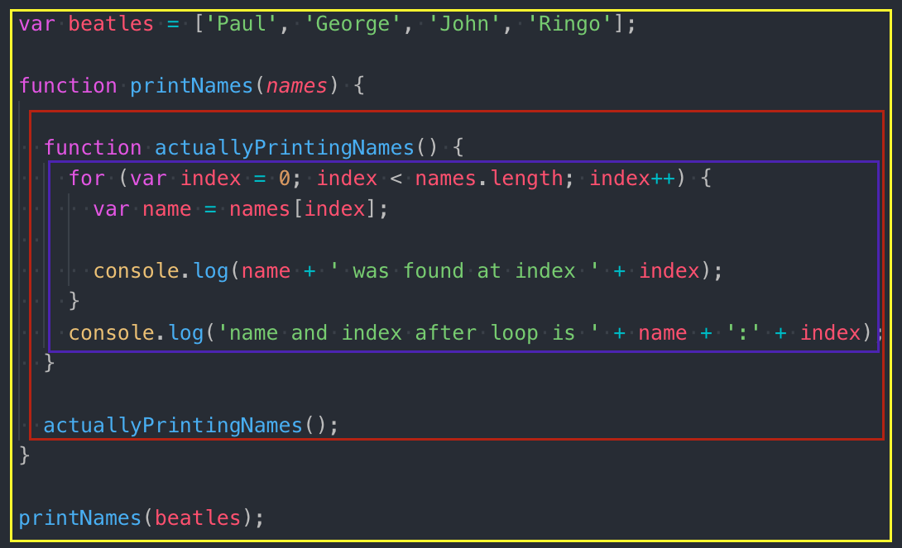

# What is scope?
Scope is the visibility, or accessibility of information, such as variables and functions, to a particular section of code. JavaScript is function scoped and traditionally has two types of scope: global and local. New scopes are created by defining functions.

## Global Scope
Every JavaScript application has a global scope. By definition that makes it omnipresent, which means that any variables or functions defined within are always available to every aspect of your application.

## Local Scope
Local scope, in contrast, has much narrower program visibility. It is localized to the particular function in which that information is defined.

## Identifying Scope
Consider the following, can you identify the different scopes in the provided sample?

```js
var beatles = ['Paul', 'George', 'John', 'Ringo'];
function printNames(names) {
  function actuallyPrintingNames() {
    for (var index = 0; index < names.length; index++) {
      var name = names[index];
  
      console.log(name + ' was found at index ' + index);
    }
    console.log('name and index after loop is ' + name + ':' + index);
  }
  actuallyPrintingNames();
}
printNames(beatles);
```
How many scopes were you able to identify? Remember that we always have a global scope, and each function will create a new scope, so we have three scopes in our sample.



If you have a background in Java or C++ you may have noticed a curiosity that our `for` loop does not create a scope, and variables that are exclusive to it, name and index, are still available after completion. That's because JavaScript is function scoped, so any variables, no matter where they are defined, are available throughout the entire scope.

## const and let
With the release of ES2015 (ES6) we have two new ways to declare variables: `const` and `let`.
These new declarations give us the ability to scope information more precisely to individual sections of code, called `block scoping`. This gives us greater control over information visibility and allows us to reuse variable names in the same function, but different code blocks, without conflict. A code block is defined by opening and closing curly braces, `{}`.

While both const and let are `block scoped` there are some differences we need to understand. `let` allows for reassignment of our declared variables content and does not require a value upon declaration. `const`, on the other hand, must assign a value at creation and that value may not change for the life of the variable. It is immutable.

With that knowledge let us refactor the previous example to use our new variable declarations. What should be constant? What information changes over time? I might posit that our names array should never assume a different array, so we should certainly use const.

```js
const beatles = ['Paul', 'George', 'John', 'Ringo'];
```
That was easy, but how about our loop? As with most answers concerning programming: it depends. Do we want name and index information available after our loop, or should it cease to exist? Let's consider both scenarios. Assume for the moment that we really like our final `console.log` we would refactor to this:
```js
function actuallyPrintingNames() {
  let index = 0;
  let name;
  for (; index < names.length; index++) {
    name = names[index];
    console.log(name + ' was found at index ' + index);
  }
  console.log('name and index after loop is ' + name + ':' + index);
}
```
    
Declaring name and index above our loop allows those variables to exist throughout the actuallyPrintingNames function, similar to if we had declared with `var`. If you find the latter console.log to be superfluous you might refactor as such:
```js
function actuallyPrintingNames() {
  for (let index = 0; index < names.length; index++) {
    let name = names[index];
    console.log(name + ' was found at index ' + index);
  }
  console.log('name and index after loop is ' + name + ':' + index);
}        
```        
Running our code will now result in an error: `ReferenceError: name is not defined` because name is only available inside our for loop. Removing it from the console.log and running again will result in the same error but referencing index. Even though it appears index is defined outside the loop block, `{}`, it is still part of the overall construct of our loop and included in its scope. Delete the console.log statement. One last modification before moving on: name doesn't change during iteration, so it needs to be a const.
```js
const name = names[index];
```
You might think this change doesn't make sense, because, while name doesn't change on one iteration, it will certainly change on the next. That's true, but the nature of block scoping creates an 'environment' for that iteration only and on the next a whole new environment will exist for the block. Our final refactored code should look like this:
```js
const beatles = ['Paul', 'George', 'John', 'Ringo'];
function printNames(names) {
  function actuallyPrintingNames() {
    for (let index = 0; index < names.length; index++) {
      const name = names[index];
  
      console.log(name + ' was found at index ' + index);
    }
  }
  actuallyPrintingNames();
}
printNames(beatles);
```
We are able to mix usage of `var` with `const` and `let`, but now that we have a better understanding of these newer declarations we should avoid using var whenever possible.
#
## [Previous](./002_Debuging.md)<span>&nbsp;&nbsp;&nbsp;&nbsp;&nbsp;&nbsp;&nbsp;&nbsp;&nbsp;&nbsp;&nbsp;&nbsp;&nbsp;&nbsp;&nbsp;&nbsp;&nbsp;&nbsp;&nbsp;&nbsp;&nbsp;&nbsp;&nbsp;&nbsp;&nbsp;&nbsp;&nbsp;&nbsp;&nbsp;&nbsp;&nbsp;&nbsp;&nbsp;&nbsp;&nbsp;&nbsp;&nbsp;&nbsp;&nbsp;&nbsp;&nbsp;&nbsp;&nbsp;&nbsp;&nbsp;&nbsp;&nbsp;&nbsp;&nbsp;&nbsp;&nbsp;&nbsp;&nbsp;&nbsp;&nbsp;&nbsp;&nbsp;&nbsp;&nbsp;&nbsp;&nbsp;&nbsp;&nbsp;&nbsp;&nbsp;&nbsp;&nbsp;&nbsp;&nbsp;&nbsp;&nbsp;&nbsp;&nbsp;&nbsp;&nbsp;&nbsp;&nbsp;&nbsp;&nbsp;&nbsp;&nbsp;&nbsp;&nbsp;&nbsp;&nbsp;&nbsp;&nbsp;</span> [Next](./004_Hoisting.md)
#
##  [Index](../../Index.md)