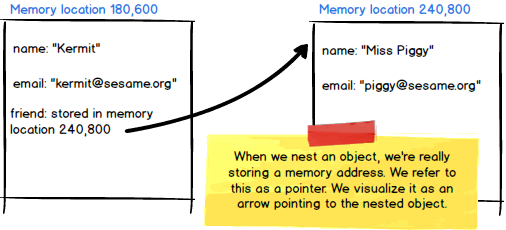

# Overview
__OOP (Object Oriented Programming)__ is something that has revolutionized the way that programming is done today. If used correctly, it can save you loads of time. It will also help you to avoid repeating code to solve the same simple problem and ake maintaining your code easy and effective. In this chapter, you'll learn how to use and implement OOP.

Understanding object-oriented programming principles is the key to making your code more organized and modular. This chapter is designed to teach object-oriented programming principles to help you better understand how to organize your code in the future.

__As you know JavaScript uses a functional programming style__. This means that Classes aren't a core part of the JavaScript language and JavaScript isn't inherently Object Oriented. __But this doesn't mean that we don't use an OOP style of programming in all of our work__. We __pair JavaScript Objects and Functions to create Constructors that can mimic an Object Oriented Programming style__. Therefore, it is extremely important to understand the fundamental concepts of OOP so that the purpose of these constructors is clearer.

Object oriented programming is used so that we can create models to represent what we have in the real world. For example, in the real world we have visitors to our website, whom we lovingly call 'users'. A user is a real flesh and blood living person, but in our program, we'll use an object to represent the user. Within the object, we may store any data we need to know about the user.
```js
const user1 = {
    name: "Kermit",
    email: "kermit@sesame.org"
}
```
__Nesting objects__ is an essential concept to master. We may store any data we like within an object, even another object! As we nest more and more objects, we may wonder how so much memory can be stored in one object. It's actually pretty interesting how the memory is allocated. The nested object gets its own separate __place__ in memory. The outer object then points to that memory address. Examine the code below and visualize user1's friend as occupying a location in memory apart from where user1 is stored. Though it looks like we're storing the friend within user1, what we're really storing in user1 is just the __address in memory__ where the friend object is stored.
```js
const user1 = {
    name: "Kermit",
    email: "kermit@sesame.org",
    friend: {
        name: "Miss Piggy",
        email: "piggy@sesame.org"
    }
}
```


As we create more and more user objects, we may want a shortcut to create user __instances__. You may remember using classes to do this in other languages, such as Python. JavaScript is not class-based, but we do have __object constructors__! Not surprisingly, object constructors are used to construct objects. They are functions that make new instances. Within the object constructor, we may define the basic blueprint that we would like our objects to follow by setting the attributes and methods each object should have.

We will discuss object constructors in more detail in the upcoming days. For now, think about this: Our code above says that Miss Piggy is Kermit's friend. __How do we alter our code so that Kermit is also Miss Piggy's friend__?
#
## [Previous](./../003_Fundamentals/010_Ternary_Operator.md)<span>&nbsp;&nbsp;&nbsp;&nbsp;&nbsp;&nbsp;&nbsp;&nbsp;&nbsp;&nbsp;&nbsp;&nbsp;&nbsp;&nbsp;&nbsp;&nbsp;&nbsp;&nbsp;&nbsp;&nbsp;&nbsp;&nbsp;&nbsp;&nbsp;&nbsp;&nbsp;&nbsp;&nbsp;&nbsp;&nbsp;&nbsp;&nbsp;&nbsp;&nbsp;&nbsp;&nbsp;&nbsp;&nbsp;&nbsp;&nbsp;&nbsp;&nbsp;&nbsp;&nbsp;&nbsp;&nbsp;&nbsp;&nbsp;&nbsp;&nbsp;&nbsp;&nbsp;&nbsp;&nbsp;&nbsp;&nbsp;&nbsp;&nbsp;&nbsp;&nbsp;&nbsp;&nbsp;&nbsp;&nbsp;&nbsp;&nbsp;&nbsp;&nbsp;&nbsp;&nbsp;&nbsp;&nbsp;&nbsp;&nbsp;&nbsp;&nbsp;&nbsp;&nbsp;&nbsp;&nbsp;&nbsp;&nbsp;&nbsp;&nbsp;&nbsp;&nbsp;&nbsp;</span> [Next](./002_Classes.md)
#
##  [Index](../../Index.md)