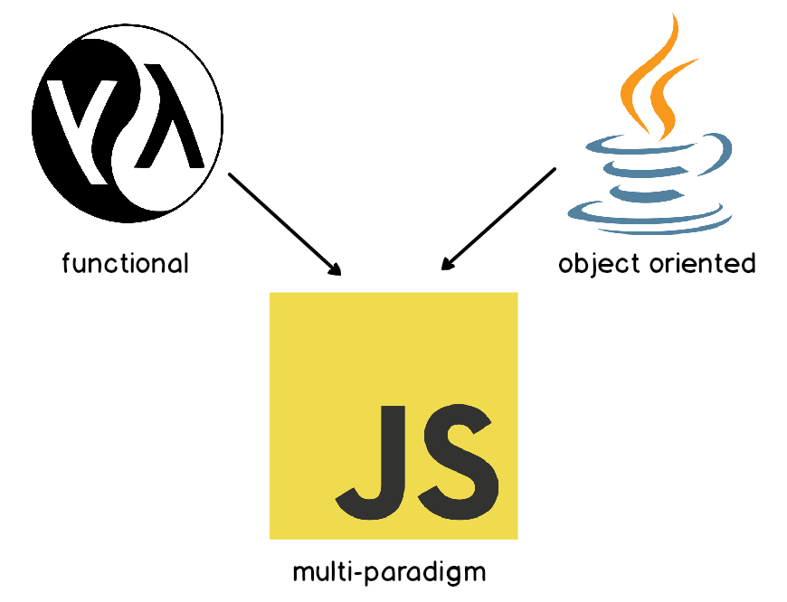

# JavaScript is Multi-Paradigm
When JavaScript was initially being designed, it was envisioned that the language would work like popular functional languages like Lisp, however at the time Java (an Object Oriented Language) was (and still is) very popular and it was decided to make JavaScript resemble a scripting version of Java. As such JavaScript retains a syntax that at least superficially resembles Java, but functions are (first class) treated like just any other variable and JavaScript also supports writing programs in an OOP style (through prototype inheritance). As such JavaScript is multi-paradigm and we can write it procedurally, functionally, or object oriented-ly or any combination of the above.

In the early days of front-end frameworks, AngularJS was designed to apply the MVC pattern (Models Views Controllers) to our front-end and as such a lot of OOP was being used. More recently with React, Vue, and Angular (from version 2 onward) the patterns moved away from MVC to what's known as Component Based Architecture. Many lessons have been learned in this time about how shared state and bi-directional data flow are not necessarily the best way, and many developers using these frameworks have moved in the direction of Functional Programming.

Functional Programming is a completely different way of designing our programs, instead of making classes (things that tightly bind both data and functions together) we will be separating the data from the actions.

## When using functional programming, our functions should:
*   be transparent: every time a function is called with the same inputs it should return the same results 
*   be pure: the function should remain "pure" and the values of the parameter passed in are not allowed to be changed... we will be making copies of arrays or objects passed in rather than working "in-place"
*   avoid side effects: the function shouldn't make API calls, write to file-systems or databases, or print to console
*   never be void: our functions have to return a value... if they don't then what they did must have violated one of our previous rules around side-effects, or mutating an input

If this all sounds incredibly limiting, that's because it is. However following these patterns will make bugs easy to spot and can result in a performance boost from using immutable data structures.

__Note__: it won't be possible for every function we write in our projects to be "transparent and without side-effects" as getting information from an API or Database, generating random numbers, or getting date times will violate some rules for our functions.
#
## [Previous](./../004_OOP/003_Inheritance_Super.md)&nbsp;&nbsp;&nbsp;&nbsp;&nbsp;&nbsp;&nbsp;&nbsp;&nbsp;&nbsp;&nbsp;&nbsp;&nbsp;&nbsp;&nbsp;&nbsp;&nbsp;&nbsp;&nbsp;&nbsp;&nbsp;&nbsp;&nbsp;&nbsp;&nbsp;&nbsp;&nbsp;&nbsp;&nbsp;&nbsp;&nbsp;&nbsp;&nbsp;&nbsp;&nbsp;&nbsp;&nbsp;&nbsp;&nbsp;&nbsp;&nbsp;&nbsp;&nbsp;&nbsp;&nbsp;&nbsp;&nbsp;&nbsp;&nbsp;&nbsp;&nbsp;&nbsp;&nbsp;&nbsp;&nbsp;&nbsp;&nbsp;&nbsp;&nbsp;&nbsp;&nbsp;&nbsp;&nbsp;&nbsp;&nbsp;&nbsp;&nbsp;&nbsp;&nbsp;&nbsp;&nbsp;&nbsp;&nbsp;&nbsp;&nbsp;&nbsp;&nbsp;&nbsp;&nbsp;&nbsp;&nbsp;&nbsp;&nbsp;&nbsp;&nbsp;&nbsp;&nbsp; [Next](./002_Callback-Functions.md)
#
##  [Index](../../Index.md)