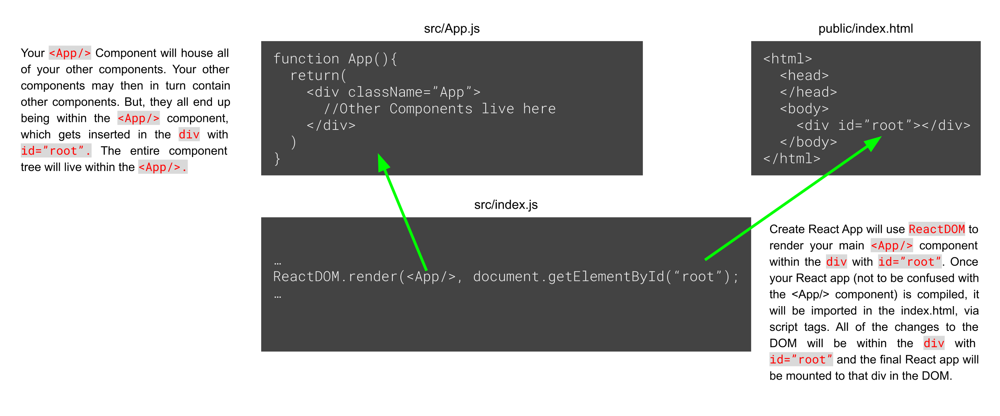

# Create React App

Modern JavaScript projects typically use bundlers to "build" source code into production-ready files. One of the most popular bundlers is called Webpack. Webpack is an amazing tool that allows us to break our apps down into smaller modules and transform them based on tools called loaders. It's definitely a technology worth looking into, and you should spend some time working through the [Getting Started](https://webpack.js.org/guides/getting-started/) tutorial.

However, Webpack is not the focus of this React workshop. We'll instead lean on the opinionated starter kit create-react-app, which uses Webpack under the hood.

## create-react-app
Using this starter kit is as simple as running the following command in your terminal:

`npx create-react-app your-project-name-here` 

(NOTE: `npx` is not a typo! npx comes with npm version 5.2+ and higher)

Once the project is created, we can simply navigate into the newly-created project folder and run

`npm start`

This will run the React development server and automatically open up a browser tab navigated to our app. This starter kit also comes with a live reload feature which will reload our app every time we save changes in our code.

How your React app will work:

## Additional resources
*   [create-react-app](https://create-react-app.dev/)
*   [Webpack -- Getting started](https://webpack.js.org/guides/getting-started/)
*   [ES6 Modules](https://hacks.mozilla.org/2015/08/es6-in-depth-modules/)
*   [Intro to source maps](https://www.html5rocks.com/en/tutorials/developertools/sourcemaps/)
#
## [Previous](./004_syntactic_sugar.md)&nbsp;&nbsp;&nbsp;&nbsp;&nbsp;&nbsp;&nbsp;&nbsp;&nbsp;&nbsp;&nbsp;&nbsp;&nbsp;&nbsp;&nbsp;&nbsp;&nbsp;&nbsp;&nbsp;&nbsp;&nbsp;&nbsp;&nbsp;&nbsp;&nbsp;&nbsp;&nbsp;&nbsp;&nbsp;&nbsp;&nbsp;&nbsp;&nbsp;&nbsp;&nbsp;&nbsp;&nbsp;&nbsp;&nbsp;&nbsp;&nbsp;&nbsp;&nbsp;&nbsp;&nbsp;&nbsp;&nbsp;&nbsp;&nbsp;&nbsp;&nbsp;&nbsp;&nbsp;&nbsp;&nbsp;&nbsp;&nbsp;&nbsp;&nbsp;&nbsp;&nbsp;&nbsp;&nbsp;&nbsp;&nbsp;&nbsp;&nbsp;&nbsp;&nbsp;&nbsp;&nbsp;&nbsp;&nbsp;&nbsp;&nbsp;&nbsp;&nbsp;&nbsp;&nbsp;&nbsp;&nbsp;&nbsp;&nbsp;&nbsp;&nbsp;&nbsp;&nbsp; [Next](./006_Folder_Structure.md)
#
##  [Index](../../Index.md)