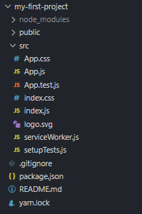

# React Folder Structure

As a React developer, you will generally have plenty of freedom over how to structure your own React projects. Since React is technically just a library, and thus very unopinionated, you can have control over it. We will be introducing a very simple way to structure your React project. This structure may not be ideal for large projects, but for smaller ones, this will do just fine.

If you are comfortable enough with React, feel free to experiment with different folder structures. Anyways, let's look at the current structure that is created with `create-react-app`.



The entry point in our React project is the `src/index.js` file. This file is where we call `ReactDOM.render`, and send in our main `<App />` component. We will be putting all of the content in our `<App />` component in the div with id=root. By importing the `<App />` component, we can then put all of our React code within that component. That brings us over to `src/App.js.` This file will be where we can actually point the rest of our code towards. It looks something like this:
```jsx
import React from 'react';
import logo from './logo.svg';
import './App.css';
 
function App() {
  return (
    <div className="App">
      <header className="App-header">
        
        <p>
          Edit <code>src/App.js</code> and save to reload.
        </p>
        <a
          className="App-link"
          href="https://reactjs.org"
          target="_blank"
          rel="noopener noreferrer"
        >
          Learn React
        </a>
      </header>
    </div>
  );
}
export default App;
```
This is the default React landing page. When you navigate to your project and run `npm run start`, you will notice this page displays in your browser. However, we do not need this code for our project to work. We can delete everything within the `<div className="App">`. The main import we need, though, is `import React from 'react'`. By importing React, we will be able to write in JSX, a syntax extension to JavaScript.

Within our `src` folder, let's create a new folder called "components". In this folder, we will be creating all of our components. You can think of a React component as a `div` that contains all of the styling and JavaScript that it needs.

## Further Reading:

https://reactjs.org/docs/introducing-jsx.html
#
## [Previous](./005_create-react-app.md)<span>&nbsp;&nbsp;&nbsp;&nbsp;&nbsp;&nbsp;&nbsp;&nbsp;&nbsp;&nbsp;&nbsp;&nbsp;&nbsp;&nbsp;&nbsp;&nbsp;&nbsp;&nbsp;&nbsp;&nbsp;&nbsp;&nbsp;&nbsp;&nbsp;&nbsp;&nbsp;&nbsp;&nbsp;&nbsp;&nbsp;&nbsp;&nbsp;&nbsp;&nbsp;&nbsp;&nbsp;&nbsp;&nbsp;&nbsp;&nbsp;&nbsp;&nbsp;&nbsp;&nbsp;&nbsp;&nbsp;&nbsp;&nbsp;&nbsp;&nbsp;&nbsp;&nbsp;&nbsp;&nbsp;&nbsp;&nbsp;&nbsp;&nbsp;&nbsp;&nbsp;&nbsp;&nbsp;&nbsp;&nbsp;&nbsp;&nbsp;&nbsp;&nbsp;&nbsp;&nbsp;&nbsp;&nbsp;&nbsp;&nbsp;&nbsp;&nbsp;&nbsp;&nbsp;&nbsp;&nbsp;&nbsp;&nbsp;&nbsp;&nbsp;&nbsp;&nbsp;&nbsp;</span> [Next](./007_Using_JSX.md)
#
##  [Index](../../Index.md)