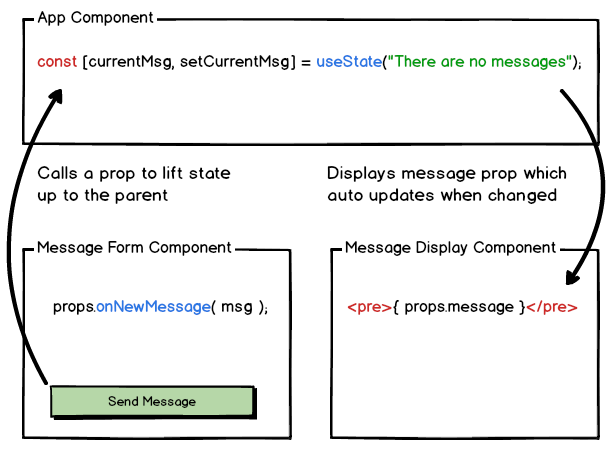

# Lifting State
Let's say we want to make an app that contains a component for creating messages and another component for displaying messages.


### MessageForm.jsx
```jsx
import react, { useState } from 'react';
    
    
const MessageForm = (props) => {
    const [msg, setMsg] = useState("");
    
    const handleSubmit = (e) => {
        e.preventDefault();
        // what should we do with the message?
    };
    
    return (
        <form onSubmit={ handleSubmit }>
            <h1>Set Message</h1>
            <textarea 
                rows="4"
                cols="50"
                placeholder="Enter your message here"
                onChange={ (e) => setMsg(e.target.value }
                value={ msg }
            ></textarea>
            <input type="submit" value="Send Message" />
        </form>
    );
};
    
export default MessageForm;
```
### MessageDisplay.jsx
```jsx
import react, { useState } from 'react';
    
    
const MessageDisplay = (props) => {
    return (
        <>
            <h1>Current Message</h1>
            <pre>{ props.message }</pre>
        </>
    );
};
    
export default MessageDisplay;
```
### App.js
```jsx
import React, { useState } from 'react';
import MessageForm from './Components/MessageForm';
import MessageDisplay from './Components/MessageDisplay';
    
    
function App() {
    const [currentMsg, setCurrentMsg] = useState("There are no messages");
    
    return (
        <>
            <MessageForm />
            <MessageDisplay message={ currentMsg } />
        </>
    );
}
    
export default App;
```
When we go to submit the form, we have access to the message information inside of `<MessageForm />`, but how do we get that information into our `<MessageDisplay />`? We could consider putting the `<MessageDisplay />` inside of `<MessageForm />` and passing the message as a prop to it. This will work, but what if there is another way.


## Props can be functions


The solution is that we can provide a prop to the `<MessageForm />` from the parent of both it and `<MessageDisplay />`. If this prop is a function, then we can have the child component call the function. And if the function accepts a parameter, then the child can pass a parameter into this function.

### App.js

```jsx
// imports removed for brevity
function App() {
    const [currentMsg, setCurrentMsg] = useState("There are no messages");
    
    const youveGotMail = ( newMessage ) => {
        setCurrentMsg( newMessage );
    }
    
    return (
        <>
            <MessageForm onNewMessage={ youveGotMail } />
            <MessageDisplay message={ currentmsg } />
        </>
    );
}
    
```
We need to pass a new prop into `<MessageForm />`, we can call this `onNewMessage` and make this prop pass along the `yoveGotMail` function. When the child component uses the `onNewMessage` prop, it can pass a newMessage parameter into it. This will run the `youveGotMail` function inside of App which takes the `newMessage` and sets the `currentMsg` to it.


### MessageForm.jsx
```jsx
// most of the component removed for brevity
const handleSubmit = (e) => {
    e.preventDefault();
    props.onNewMessage( msg );
};
```
Now when handling submitting the form, we can use the `onNewMessage` prop to pass that message up to `App.js`.



When we submit the form in `<MessageForm />` it passes the information up to the parent `<App />` component which in turn passes it down to the `<MessageDisplay />` component. This then displays our message.


## Further reading:
* [Lifting State](https://reactjs.org/docs/lifting-state-up.html)

    

