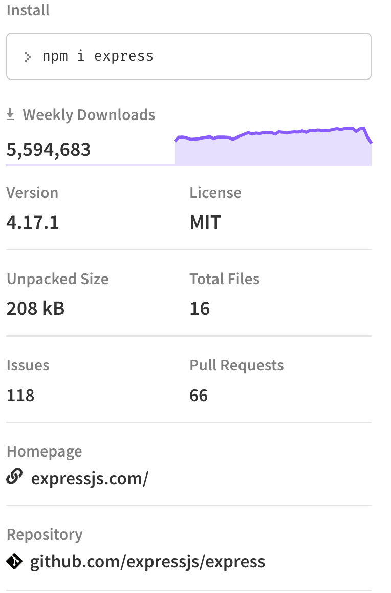

#   Express
##  Learning Objectives:
*   Learning how to start up our first Express Server
#
##  What is Express?
__Express.js__ is a framework written in JavaScript which acts as an interface to Node's server functionality. It is also the __E__ in the __MERN__ stack, so it must be important! Express allows us to create a robust server with more or less whatever architecture we choose. There are many other server frameworks for Node including Hapi, Koa, and Fastify; however Express is extremely popular, as evidenced by its weekly download stats on npmjs.com.



## Using Express
You can download the boilerplate code [HERE](https://s3.amazonaws.com/General_V88/boomyeah2015/codingdojo/curriculum/content/chapter/HelloExpress.zip). Once the download is complete, open up your terminal and navigate to the project folder and run the command:
```
npm install
```
This will install all the dependencies of the project listed in the package.json file. In this case, the only dependency that will be installed is Express.

##  Creating our Server:
To start, we need to create a new project and create a new server.js file inside our newly created project folder __(if you downloaded the project, this is done for you already)__.

In our server.js file we need to import the express module using JavaScript's `require()` statement, and then invoke express.

## HelloExpress/server.js
```js
const express = require("express");
const app = express();
const port = 8000;
```
Now we have the ability to create our routes and send some data.

##  HelloExpress/server.js
```js
const express = require("express");
const app = express();
const port = 8000;
    
// req is shorthand for request
// res is shorthand for response
app.get("/api", (req, res) => {
    res.json({ message: "Hello World" });
});
```
Note that the app instance has various HTTP verb methods that we can call. For example, by invoking app.get, we're saying we want to handle GET requests at this particular route ("/api"). The second argument passed to the get method is the callback function we want to run when a browser makes a request to this route.

Last but not least is the `app.listen()` line of code that actually runs our server on a specified port.


```js
// this needs to below the other code blocks
app.listen( port, () => console.log(`Listening on port: ${port}`) );
```
Run the server by opening your terminal, navigating to the directory housing your server.js file, and typing
```
node server.js
```
You can now visit `localhost:8000/api` in your browser to see the magic!


## Nodemon
When we run the server using `node server.js` we will have to restart the server manually every time we update our code; otherwise, the running app will not reflect the changes. This is where Nodemon comes into play. We can run the following command to install Nodemon globally.
```
npm install -g nodemon
```
Note: If your using a Mac (or Linux) You may need to use `sudo` in order to install it globally
```
sudo npm install -g nodemon
```
Instead of `node server.js` use `nodemon server.js` to run the server. This way, every change we save will automatically restart the server without us having to do anything. 

Test this out by changing the string value in the `res.json({ message: "" })` method. Go ahead and give it a try.
#
## [Previous](./003_HTTP_Verbs.md)<span>&nbsp;&nbsp;&nbsp;&nbsp;&nbsp;&nbsp;&nbsp;&nbsp;&nbsp;&nbsp;&nbsp;&nbsp;&nbsp;&nbsp;&nbsp;&nbsp;&nbsp;&nbsp;&nbsp;&nbsp;&nbsp;&nbsp;&nbsp;&nbsp;&nbsp;&nbsp;&nbsp;&nbsp;&nbsp;&nbsp;&nbsp;&nbsp;&nbsp;&nbsp;&nbsp;&nbsp;&nbsp;&nbsp;&nbsp;&nbsp;&nbsp;&nbsp;&nbsp;&nbsp;&nbsp;&nbsp;&nbsp;&nbsp;&nbsp;&nbsp;&nbsp;&nbsp;&nbsp;&nbsp;&nbsp;&nbsp;&nbsp;&nbsp;&nbsp;&nbsp;&nbsp;&nbsp;&nbsp;&nbsp;&nbsp;&nbsp;&nbsp;&nbsp;&nbsp;&nbsp;&nbsp;&nbsp;&nbsp;&nbsp;&nbsp;&nbsp;&nbsp;&nbsp;&nbsp;&nbsp;&nbsp;&nbsp;&nbsp;&nbsp;&nbsp;&nbsp;&nbsp;</span> [Next](./005_GET_POST.md)
#
##  [Index](../Index.md)