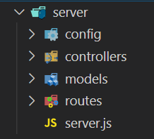

#   Server Folder Structure
As we make our way into learning MongoDB let's first go into the modular folder structure. It's always great practice to get in the habit of modularizing your projects early. As your projects grow, it will be a lot harder to keep track of all your content if you don't modularize. Let's dive into how we split our code into different files.

##  Folder Structure
Since Express will be strictly for handling all communication with the database, we want to structure our project based on our models. Here's what our folder structure will look like:




*   server - will hold all server related files
    *   controllers - will hold all logic for each model (i.e creating, updating, etc...)
    *   models - will hold all the schemas
    *   routes - will handle all of our routes for each model
    *   server.js - will handle all the server logic with express


##  Modules
The ability to include code from other files within another is extremely important in a back-end environment. If you recall, we do this with front-end JavaScript by adding `script` tags with the `src` attribute pointing to the right place. But in NodeJS, we need to be able to pull code from JavaScript files into other JavaScript files so a simple script tag will not do any good for us.

To do this, we can use Javascript's built-in tools to import and export between files:

1.  `require("./filePathGoesHere")` - used to import from different files
2.  `module.exports = WhateverYouNeedToExportGoesHere` - used to export whatever content you need to export from that file
##  Exporting in Node
You can download the boilerplate project [HERE](https://s3.amazonaws.com/General_V88/boomyeah2015/codingdojo/curriculum/content/chapter/Modules.zip) so you can follow along.

There are multiple ways we can export code using module.exports. 
Here are a couple of ways we can export multiple functions using an object:
```js
module.exports.greet = function() {
  console.log("Hello! We are exporting a function called Greet.");
};
 
module.exports.add = function(num1, num2) {
  console.log("The sum is: ", num1 + num2);
};
```
```js
module.exports = {
  greet: function() {
    console.log("Hello! We are exporting a function called Greet.");
  },
  add: function(num1, num2) {
    console.log("The sum is: ", num1 + num2);
  }
}
```
Both of these export methods are exporting the same function just in a different way. The syntax in which you choose to export is your choice.

##  Importing in Node
There are also multiple ways we can Import our functions:

Save our exports in a variable:
```js
const myCustomModule = require("./my_module");
myCustomModule.greet();
myCustomModule.add(5, 7);
```
Or we can use destructuring:
```js
const { greet, add } require("./my_module");
greet();
add(5, 7);
```

##  IMPORTANT NOTES:
You'll notice that we `require` the string __"./my_module"__. There are 2 things to note here:

1.  There is no `.js` at the end of the file. The require method automatically looks for JavaScript files, so we don't need to include the `.js` file extension.
2.  The files __app.js__ and __my_module.js__ are in the same directory. Normally, the __require()__ method looks for node modules that aren't in the same directory as the file that is running; by default, the __require() method looks for the modules located in a folder called node_modules__. To tell __require() to look in the current directory__ (i.e. the folder that the file is located in) __we have to include "./" in front of the file path. "./" (dot-slash) is the file path for the current directory__
  
  #
## [Previous](./005_GET_POST.md)<span>&nbsp;&nbsp;&nbsp;&nbsp;&nbsp;&nbsp;&nbsp;&nbsp;&nbsp;&nbsp;&nbsp;&nbsp;&nbsp;&nbsp;&nbsp;&nbsp;&nbsp;&nbsp;&nbsp;&nbsp;&nbsp;&nbsp;&nbsp;&nbsp;&nbsp;&nbsp;&nbsp;&nbsp;&nbsp;&nbsp;&nbsp;&nbsp;&nbsp;&nbsp;&nbsp;&nbsp;&nbsp;&nbsp;&nbsp;&nbsp;&nbsp;&nbsp;&nbsp;&nbsp;&nbsp;&nbsp;&nbsp;&nbsp;&nbsp;&nbsp;&nbsp;&nbsp;&nbsp;&nbsp;&nbsp;&nbsp;&nbsp;&nbsp;&nbsp;&nbsp;&nbsp;&nbsp;&nbsp;&nbsp;&nbsp;&nbsp;&nbsp;&nbsp;&nbsp;&nbsp;&nbsp;&nbsp;&nbsp;&nbsp;&nbsp;&nbsp;&nbsp;&nbsp;&nbsp;&nbsp;&nbsp;&nbsp;&nbsp;&nbsp;&nbsp;&nbsp;&nbsp;</span> [Next](./../Readings_004_MongoDB/001_Overview.md)
#
##  [Index](../../Index.md)