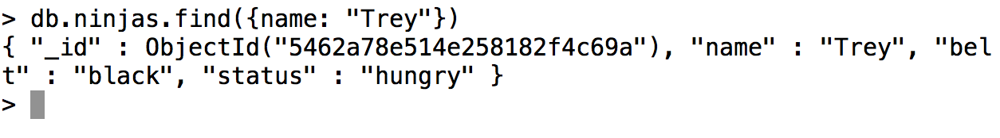
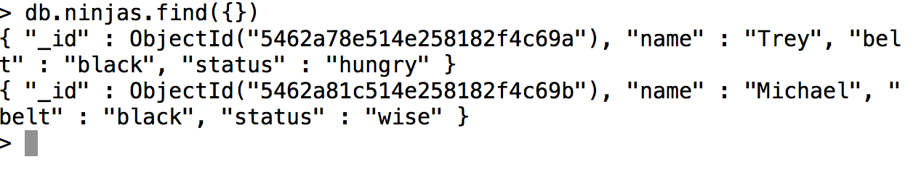
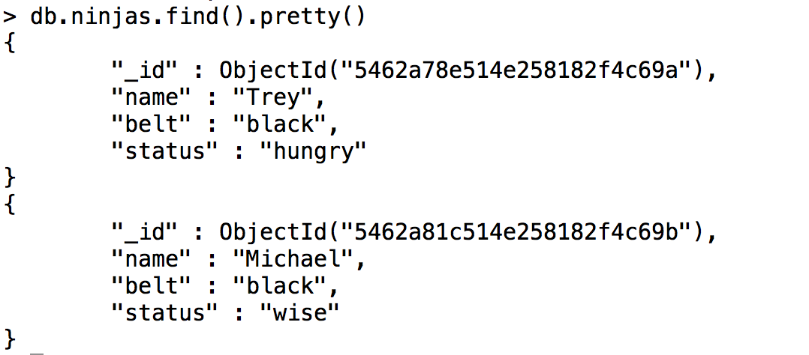
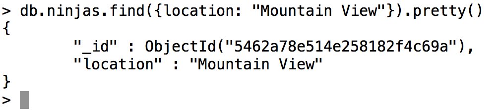

#   Documents

### __Let's create some CRUD operations__
Now let's learn some basic CRUD  (Create, Read, Update, Destroy) operations for MongoDB. Pay attention to the structure of these queries, as it is quite different than what you're used to (but it is still cohesive). You won't use raw MongoDB syntax in development very much, but all the tools built on top of MongoDB are built with these basic building blocks in mind. 

###  __CREATE - Inserting a document into a collection:__
```js
// Pattern:
db.COLLECTION_NAME.insert({YOUR_JSON_DOCUMENT})  
 
// Example:
db.ninjas.insert({name: "Trey", belt: "black", status: "awesome"})
```
Notice that what we're doing is basically JavaScript. The format of the document (BSON object) going into the database is exactly the format it will be available to you coming back out of the database. Get comfortable using this syntax by inserting a bunch of things into your collections.

###  __READ - Retrieving documents from a collection:__
To retrieve documents from your collections, you will use the following method.
```js
// Pattern: 
db.COLLECTION_NAME.find({YOUR_QUERY_DOCUMENT})
```
The parameter we pass to this method is a document. Everything in the document will match the fields in the database and only those documents that match the query document will be returned back from the query. Here's an example using the ninja document we just made.
```js
// Example:
db.ninjas.find({name: "Trey"})
```
###  __Here is what the result should look like:__



MongoDB by default returns as many results as it can. If you want to just find __all__ of the given collection, you can pass an __empty object__ to the .__find__ method; or you can just not pass anything at all.
```js
// Examples:
db.ninjas.find({})    
db.ninjas.find()
```
### __Here are the results:__



If you want to make the results look nicer and be easier to read:
```js
// Example:
db.ninjas.find().pretty()
```
Result:



If you noticed, there is a field called ___id__ on both records we put in the database. That is the MongoDB __ObjectId__, which MongoDB will __automatically__ make for you if you do not specify a value for _id. To query by id, you have to do the following:
```js
// Example:
db.ninjas.find({_id: ObjectId("5462a78e514e258182f4c69a")})
// Notice: You can't just pass the string of characters, you must pass it as an 
ObjectId.
```
__HINT__: if you want to sort by something like __creation time__ in MongoDB, you can __sort__ by ObjectId because it is made by using a time stamp as part of the string.

### __DESTROY - Removing documents from a collection:__
To remove an item from the database, we would run the following syntax:
```js
// Pattern:
db.COLLECTION_NAME.remove({YOUR_QUERY_DOCUMENT}, BOOLEAN)
// Example
db.ninjas.remove({belt: "yellow"})
db.ninjas.remove({belt: "yellow"}, false) // this query would have the same effect as the one above.
```
The query document is everything you want the deletion targets to match. The second parameter is a __boolean__, and it is __OPTIONAL__. If the parameter is __omitted__, it defaults to __false__. The boolean is called the __justOne__ boolean, and __if it is present and it is true, the remove query will only remove the first document that matches the query__. Play around with this if it confuses you.

### __UPDATE - Updating documents in a collection:__
The update syntax can be tricky if you do not see it done correctly first. Let's say I wanted to add a location to the ninja whose name is Trey. I want to make his location equal to Mountain View. I would try to the following:
```js
// Example:
db.ninjas.update({name: "Trey"}, {location: "Mountain View"})
```
Then, to check to make sure if my update query was right, I'd run:
```js
// Example:
db.ninjas.find({location: "Mountain View"}).pretty() 
```
Result:



This is an important lesson to learn. Even though the query erased most of the data for this document, the syntax for the update statement was correct. We pass two documents to the method: the first one is the query document, meaning that any document that will get updated must match the query. The second document is the document that contains the fields we want to add. The full syntax for the update query is this:
```js
// Pattern:
db.COLLECTION_NAME.update({QUERY}, {FIELDS_TO_UPDATE}, {OPTIONS})  
// Note: the options document is optional
```
MongoDB's native update method will completely overwrite everything __except__ the _id field when we run the way shown above.  If we wanted to run the update to only add to the document, (not overwrite it) we would run the following (let's pretend we didn't run the query that erased all of our data):
```js
// Example:
db.ninjas.update({name: "Trey"}, {$set: {location: "Mountain View"}})
```
By default, the update method updates __the first document that matches the first parameter passed to the function__. In this case, it was the first object whose __name__ key had a value of "Trey". The __second parameter__ in the desired query contains what is called an __update operator__. There are several different types of operators in MongoDB, and we will go over the most common later in the chapter.
#
## [Previous](./004_Basics.md)<span>&nbsp;&nbsp;&nbsp;&nbsp;&nbsp;&nbsp;&nbsp;&nbsp;&nbsp;&nbsp;&nbsp;&nbsp;&nbsp;&nbsp;&nbsp;&nbsp;&nbsp;&nbsp;&nbsp;&nbsp;&nbsp;&nbsp;&nbsp;&nbsp;&nbsp;&nbsp;&nbsp;&nbsp;&nbsp;&nbsp;&nbsp;&nbsp;&nbsp;&nbsp;&nbsp;&nbsp;&nbsp;&nbsp;&nbsp;&nbsp;&nbsp;&nbsp;&nbsp;&nbsp;&nbsp;&nbsp;&nbsp;&nbsp;&nbsp;&nbsp;&nbsp;&nbsp;&nbsp;&nbsp;&nbsp;&nbsp;&nbsp;&nbsp;&nbsp;&nbsp;&nbsp;&nbsp;&nbsp;&nbsp;&nbsp;&nbsp;&nbsp;&nbsp;&nbsp;&nbsp;&nbsp;&nbsp;&nbsp;&nbsp;&nbsp;&nbsp;&nbsp;&nbsp;&nbsp;&nbsp;&nbsp;&nbsp;&nbsp;&nbsp;&nbsp;&nbsp;&nbsp;</span> [Next](./006_Operators.md)
#
##  [Index](../Index.md)