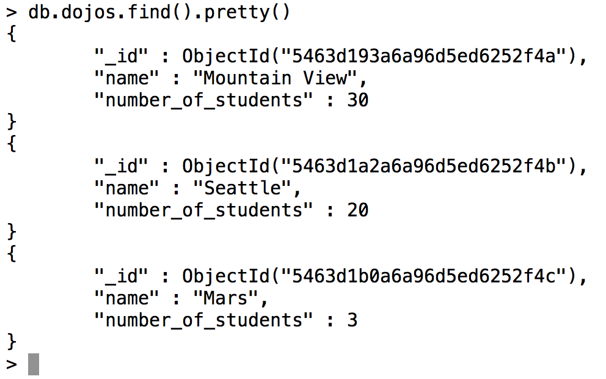
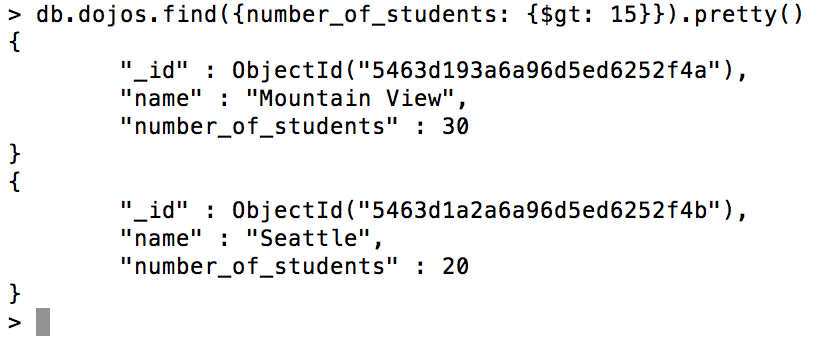
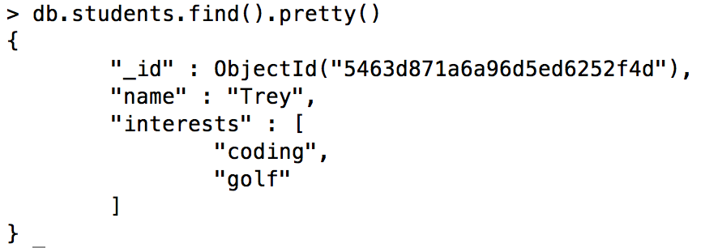

#   Operators
__Operators__ are an important part of MongoDB. You've already seen the __$set__ operator in the update method, so you should be aware of their existence. Since our queries are more __method-based__ and not __typed syntax__ like regular SQL, we need to pack more functionality into the documents we use to query our databases. Enter operators.  __Operators allow you to 'operate'__ on the data (lame description, I know). Let's say I have the following __documents__ in a __collection__ called __dojos__ that looked like this:



If I wanted to get all the Dojos whose __number of students is greater than 15__, I would run the following:
```js
db.dojos.find({number_of_students: {$gt: 15}})
```


The structure of the query should make sense; the extra document that contains the operator __({$gt: 15})__ is being applied to the __number of students__ field of the __dojos collection__.  That key-value pair is the __document__ we pass to the __.find() method__, and we are off and running.

__Here is a chart of the most frequently-used operators (take some time to play around with them):__

name    |	description
----------- | ----------
$gt (greater than)  |	Use to query selectively on numerical-valued fields
$gte (greater than or equal to) | Use to query selectively on numerical-valued fields
$lt (less than)	| Use to query selectively on numerical-valued fields
$lte (less than or equal to) | Use to query selectively on numerical-valued fields
$in (in array) | Use to find documents who have a particular value within an array.

Check out the full lists of operators [here at MongoDB's official site](http://docs.mongodb.org/manual/reference/operator/). There are tons to go through, make sure you don't spend more than 20 minutes digging around!

### __Operators with arrays__
Perhaps the most important difference in data structures of NoSQL databases compared to traditional SQL is that we have the ability to have a key-value pair where the value can hold multiple pieces of information. If you can think back to the normalization rules of relational databases, one of the key rules was that no column in a table could have multiple values. This doesn't apply to a NoSQL database.Let's say we had a students collection with a student that looked like this:



And we wanted to add an element in the interests array. The operator we would use is called the $push operator, which should sound very familiar. To add the interest 'snowboarding' to the student document, we would run...
```js
db.students.update({_id: ObjectId("5463d871a6a96d5ed6252f4d")}, {$push: {interests: 'snowboarding'}})
```
The __$push__ operator is a key of the update document, and its value is another document with a key of interests, and a value of 'snowboarding'.  Spend some time going over this if you don't understand.  Here are a couple common __array update operators__ to get familiar with:

<table>
<tr>
<th>Name</th>
<th>Description</th>
</tr>
<tr>
<td><strong>$push</strong></td>
<td>Push to an array contained within a document.</td>
</tr>
<tr>
<td><strong>$pop</strong></td>
<td>
    Removes either the first or last element from an array.
    <pre>db.COLLECTION.update({QUERY}, {$pop: {array_key: (1 or -1)}})</pre>
    Use 1 for the last item in the array, -1 for the first item.
</td>
</tr>
<tr>
<td><strong>$addToSet</strong></td>
<td> It functions just like <strong>$push</strong>.  However, <strong>$addToSet</strong> only adds to the specified array if the value doesn't already exist (thereby preventing duplicate entries). </td>
</tr>
<tr>
<td><strong>$pull</strong></td>
<td>
    Removes a specified value from an array, unlike $pop, which removes by location. Ex:
    <pre>db.COLLECTION.update({QUERY}, {$pull: {array_key: VALUE}})</pre>
    This will remove all instances of VALUE from the documents with the array specified by the array_key that match QUERY.
</td>
</tr>
</table>
<br>

There you go! Once you understand the information contained in this section of the course, you're off and running with MongoDB. They have great documentation, but it's pretty extensive. Trust what you've learned and get ready to apply this stuff directly into your projects with Mongoose in the next section!
#
## [Previous](./005_Documents.md)<span>&nbsp;&nbsp;&nbsp;&nbsp;&nbsp;&nbsp;&nbsp;&nbsp;&nbsp;&nbsp;&nbsp;&nbsp;&nbsp;&nbsp;&nbsp;&nbsp;&nbsp;&nbsp;&nbsp;&nbsp;&nbsp;&nbsp;&nbsp;&nbsp;&nbsp;&nbsp;&nbsp;&nbsp;&nbsp;&nbsp;&nbsp;&nbsp;&nbsp;&nbsp;&nbsp;&nbsp;&nbsp;&nbsp;&nbsp;&nbsp;&nbsp;&nbsp;&nbsp;&nbsp;&nbsp;&nbsp;&nbsp;&nbsp;&nbsp;&nbsp;&nbsp;&nbsp;&nbsp;&nbsp;&nbsp;&nbsp;&nbsp;&nbsp;&nbsp;&nbsp;&nbsp;&nbsp;&nbsp;&nbsp;&nbsp;&nbsp;&nbsp;&nbsp;&nbsp;&nbsp;&nbsp;&nbsp;&nbsp;&nbsp;&nbsp;&nbsp;&nbsp;&nbsp;&nbsp;&nbsp;&nbsp;&nbsp;&nbsp;&nbsp;&nbsp;&nbsp;&nbsp;</span> [Next](./007_Express_Mongoose.md)
#
##  [Index](../Index.md)