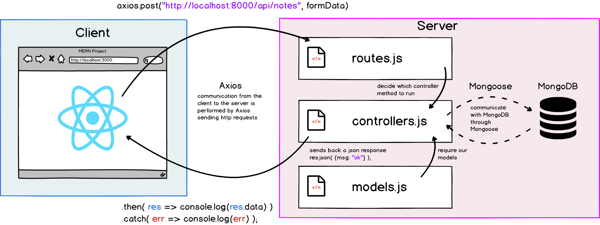

#   Intro
Up to this point, we have been separating our front end and backend entirely. When we use create-react-app, we use the command `npm run start` to serve our React application. However, we will want to include React within our Express project.

The way we will do this is by building our React project so that it creates the HTML, CSS, and Javascript files we need for our SPA. Then, we can point to it within our Express project. In the following lessons, we will learn how to set up our Full Stack MERN project and tie all of the technologies together.

Our MERN applications will use the following architecture:

We will be using Axios in our React project to communicate with our server. It is important to remember that React does not care about the language running on our server. React will simply make requests to our server and get responses.

 #
## [Previous](./../Readings_004_MongoDB/011_Using_MongoDB.md)&nbsp;&nbsp;&nbsp;&nbsp;&nbsp;&nbsp;&nbsp;&nbsp;&nbsp;&nbsp;&nbsp;&nbsp;&nbsp;&nbsp;&nbsp;&nbsp;&nbsp;&nbsp;&nbsp;&nbsp;&nbsp;&nbsp;&nbsp;&nbsp;&nbsp;&nbsp;&nbsp;&nbsp;&nbsp;&nbsp;&nbsp;&nbsp;&nbsp;&nbsp;&nbsp;&nbsp;&nbsp;&nbsp;&nbsp;&nbsp;&nbsp;&nbsp;&nbsp;&nbsp;&nbsp;&nbsp;&nbsp;&nbsp;&nbsp;&nbsp;&nbsp;&nbsp;&nbsp;&nbsp;&nbsp;&nbsp;&nbsp;&nbsp;&nbsp;&nbsp;&nbsp;&nbsp;&nbsp;&nbsp;&nbsp;&nbsp;&nbsp;&nbsp;&nbsp;&nbsp;&nbsp;&nbsp;&nbsp;&nbsp;&nbsp;&nbsp;&nbsp;&nbsp;&nbsp;&nbsp;&nbsp;&nbsp;&nbsp;&nbsp;&nbsp;&nbsp;&nbsp; [Next](./002_Full_Stack_MERN.md)
#
##  [Index](../Index.md)