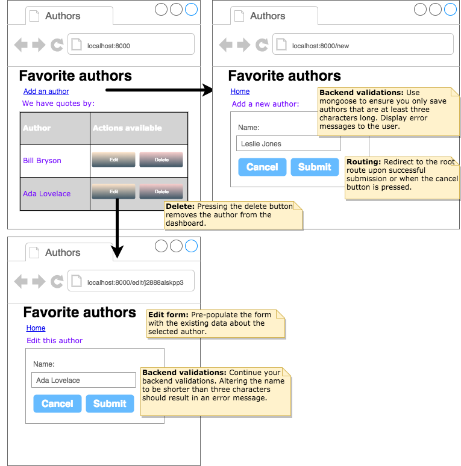

#   Authors

### __Objectives__: 

*   Create a full CRUD app with React, Express, Node, and MongoDB
*   Include backend validations
#
Create an application where users submit their favorite authors. List all the authors on the first page. From there, the user may click on a button to edit or delete each author. 

The edit form must be pre-populated with the existing data for the author. 

Use backend validations to ensure that all author names are at least three characters long. If the user does not pass validations, display an error message. Validations must also be applied when editing an author. 

__BONUS__: If someone tries to navigate to the edit page with an unrecognized id, display an error message. For example, "We're sorry, but we could not find the author you are looking for. Would you like to add this author to our database?" Then, provide a link to take them to the form to create an author. 

__BONUS__: Sort the authors alphabetically.

#
## [Previous](./006_Validations.md)&nbsp;&nbsp;&nbsp;&nbsp;&nbsp;&nbsp;&nbsp;&nbsp;&nbsp;&nbsp;&nbsp;&nbsp;&nbsp;&nbsp;&nbsp;&nbsp;&nbsp;&nbsp;&nbsp;&nbsp;&nbsp;&nbsp;&nbsp;&nbsp;&nbsp;&nbsp;&nbsp;&nbsp;&nbsp;&nbsp;&nbsp;&nbsp;&nbsp;&nbsp;&nbsp;&nbsp;&nbsp;&nbsp;&nbsp;&nbsp;&nbsp;&nbsp;&nbsp;&nbsp;&nbsp;&nbsp;&nbsp;&nbsp;&nbsp;&nbsp;&nbsp;&nbsp;&nbsp;&nbsp;&nbsp;&nbsp;&nbsp;&nbsp;&nbsp;&nbsp;&nbsp;&nbsp;&nbsp;&nbsp;&nbsp;&nbsp;&nbsp;&nbsp;&nbsp;&nbsp;&nbsp;&nbsp;&nbsp;&nbsp;&nbsp;&nbsp;&nbsp;&nbsp;&nbsp;&nbsp;&nbsp;&nbsp;&nbsp;&nbsp;&nbsp;&nbsp;&nbsp; [Next](./008_Team_Manager.md)
#
##  [Index](../Index.md)