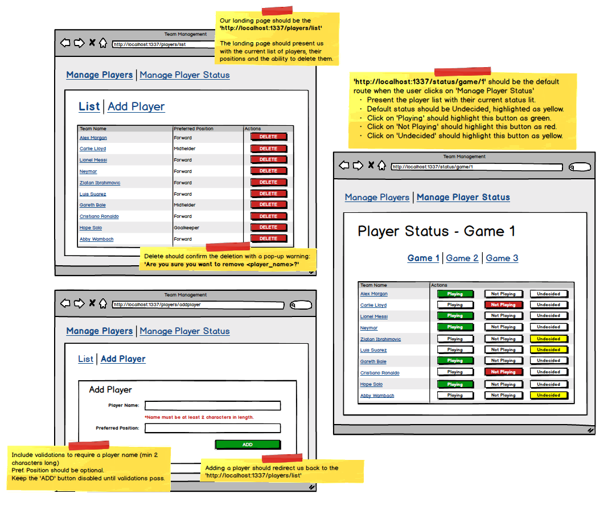

# Team Manager
Create an App 'Team Manager' which manages your team roster and RSVP for a 3 game series. Specifically, we should be able to add and remove players. We should also be able to view each player's status of 'Playing', 'Not Playing' and 'Undecided' for each of the 3 games. More details are included in the below wireframe. Make sure you read through the tasks below to understand which features are bonuses.

- [ ] Create a page to show the list of all players
- [ ] Create a page to add a new player, which redirects back to the list page
- [ ] When you delete a player, they should automatically disappear without a page refresh
- [ ] By default, all validations should come from the backend
- [ ] NINJA BONUS: Create front end validations as well
- [ ] NINJA BONUS: Create a popup to confirm deleting a player
- [ ] SENSEI BONUS: Create the Player Status page

#
## [Previous](./007_Authors.md)&nbsp;&nbsp;&nbsp;&nbsp;&nbsp;&nbsp;&nbsp;&nbsp;&nbsp;&nbsp;&nbsp;&nbsp;&nbsp;&nbsp;&nbsp;&nbsp;&nbsp;&nbsp;&nbsp;&nbsp;&nbsp;&nbsp;&nbsp;&nbsp;&nbsp;&nbsp;&nbsp;&nbsp;&nbsp;&nbsp;&nbsp;&nbsp;&nbsp;&nbsp;&nbsp;&nbsp;&nbsp;&nbsp;&nbsp;&nbsp;&nbsp;&nbsp;&nbsp;&nbsp;&nbsp;&nbsp;&nbsp;&nbsp;&nbsp;&nbsp;&nbsp;&nbsp;&nbsp;&nbsp;&nbsp;&nbsp;&nbsp;&nbsp;&nbsp;&nbsp;&nbsp;&nbsp;&nbsp;&nbsp;&nbsp;&nbsp;&nbsp;&nbsp;&nbsp;&nbsp;&nbsp;&nbsp;&nbsp;&nbsp;&nbsp;&nbsp;&nbsp;&nbsp;&nbsp;&nbsp;&nbsp;&nbsp;&nbsp;&nbsp;&nbsp;&nbsp;&nbsp; [Next](./../Readings_007_Socket.io/001_Web_Sockets.md)
#
##  [Index](../Index.md)