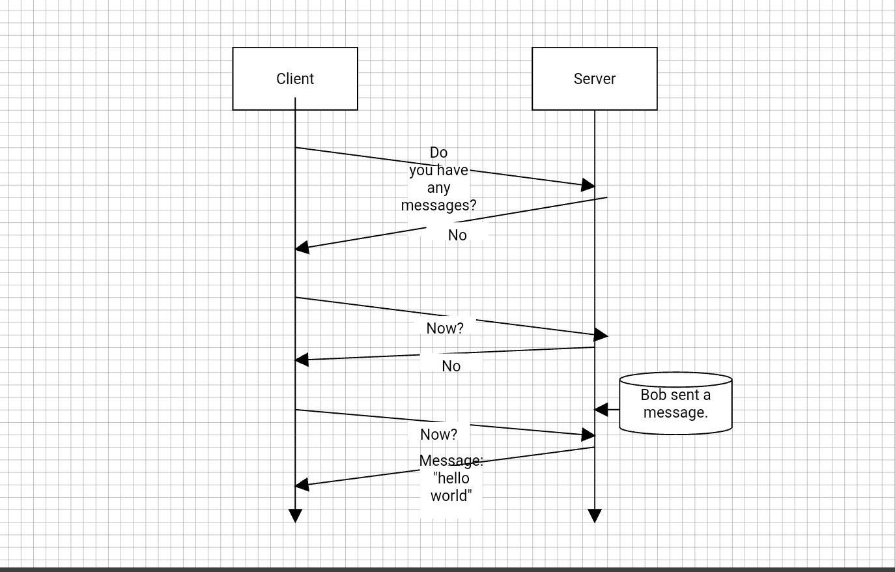
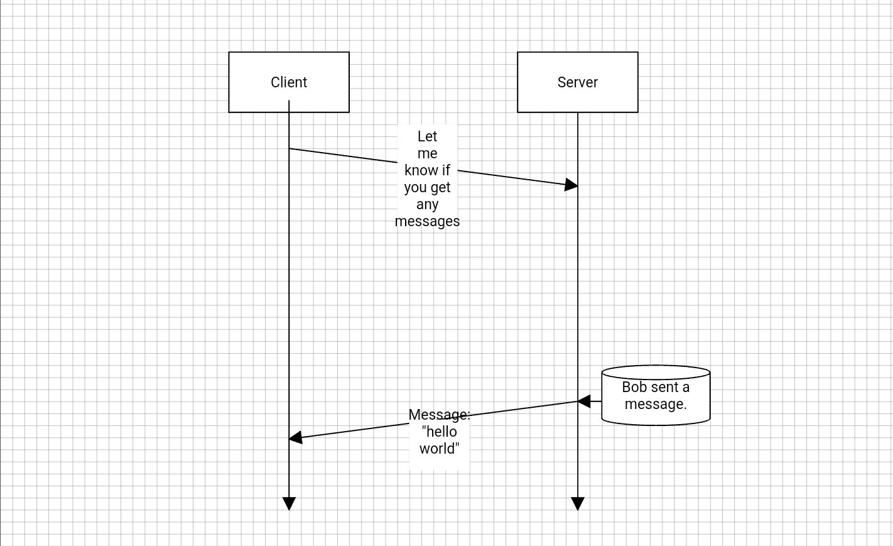

#   Web Sockets
>   ___The WebSocket API is an advanced technology that makes it possible to open a two-way interactive communication session between the user's browser and a server. With this API, you can send messages to a server and receive event-driven responses without having to poll the server for a reply.___

To help understand what a web socket is, we first need to be present to how HTTP works in the first place. Let's remove web sockets from the picture for a minute and consider an example where we are tasked with a basic chat application. There are a lot of things to consider when building a chat application from scratch (how do we want to style everything, do we want to show the list of connected users, do we want multiple chat rooms, etc...?) however, consider that for the best user experience we want messages to be displayed immediately as they are sent to all the connected clients in real-time. To accomplish this without web sockets we would have to design a function to query the database and run at an interval, say 500 milliseconds, to create the real-time effect. Below is a simple illustration showing the HTTP request/response cycle of our chat application:

Consider if this application has 300+ clients connected at one time and each client is pinging the server every 500ms checking if there is a message. This would be very inefficient and will likely result in latency issues.

Web sockets were designed to help solve this dilemma of creating a real-time environment without pinging the server every 500ms. Web sockets work by generating an "agreement" so to speak. This "agreement" is called a handshake. Once the `handshake` is complete, both the client and the server can send data to each other without making another HTTP request. 

Our new HTTP request/response cycle with Web Sockets:

 

One request from the client asks the server to watch for any and all messages sent from other clients. If a message is sent to the server, the server will send down that message to all connected clients without the need for the client to make another HTTP request.

### __The Big Picture__
A good way to visualize the client/server interaction with sockets is a tennis match. When one side sends a message, or emits an event, it's like one player has hit the ball to the other side of the court. Then, depending on the type of message, the receiving side may decide to send a message in response back to the sender, or hit the ball to the other side of the court. It's this ongoing back and forth communication that makes sockets such a powerful technology.

### __Additional Reading__
[socket.io docs](https://socket.io/docs/)

#
## [Previous](./../Readings_006_Advance_MERN/008_Team_Manager.md)&nbsp;&nbsp;&nbsp;&nbsp;&nbsp;&nbsp;&nbsp;&nbsp;&nbsp;&nbsp;&nbsp;&nbsp;&nbsp;&nbsp;&nbsp;&nbsp;&nbsp;&nbsp;&nbsp;&nbsp;&nbsp;&nbsp;&nbsp;&nbsp;&nbsp;&nbsp;&nbsp;&nbsp;&nbsp;&nbsp;&nbsp;&nbsp;&nbsp;&nbsp;&nbsp;&nbsp;&nbsp;&nbsp;&nbsp;&nbsp;&nbsp;&nbsp;&nbsp;&nbsp;&nbsp;&nbsp;&nbsp;&nbsp;&nbsp;&nbsp;&nbsp;&nbsp;&nbsp;&nbsp;&nbsp;&nbsp;&nbsp;&nbsp;&nbsp;&nbsp;&nbsp;&nbsp;&nbsp;&nbsp;&nbsp;&nbsp;&nbsp;&nbsp;&nbsp;&nbsp;&nbsp;&nbsp;&nbsp;&nbsp;&nbsp;&nbsp;&nbsp;&nbsp;&nbsp;&nbsp;&nbsp;&nbsp;&nbsp;&nbsp;&nbsp;&nbsp;&nbsp; [Next](./002_Sockets_on_the_server.md)
#
##  [Index](../Index.md)