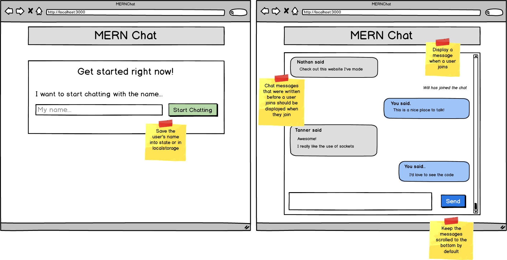

#   Classic Chat App
Building off of the previous assignment, your task is to create a fully functional chat application. Have your cohort mates help test your application throughout your development process.

__There is ONE unspoken, not found on the internet, hard to fix, not straightforward bug when building your chat app.__

On the client, when you are setting state inside of an event listener, you will need to set state in a very, very specific way. Below is what you need to know. When you call your "setter" function, instead of passing it the new value, you need to pass it a callback function that will compute the new value based on the existing value. See the diagram below for an example.


```js
const [messages, setMessages] = useState([]);

useEffect(() => {
    socket.on("new_message_from_server", msg =>
        // When setting state, you HAVE to use this exact
        // syntax. Any difference in syntax will not work
        // the way you expect.
        setMessage(prevMessages => {
            return [msg, ...prevMessages];
        });
    );
}, []);

```


Feel free to design your Chat App as you would like it, but for an example see the wireframe below.



#

### __Resources__
*   [socket.io docs](https://socket.io/docs/)
*   [Functional Updates](https://reactjs.org/docs/hooks-reference.html#functional-updates)
  
 - [ ] Build a fully functional chat application
 - [ ] Bonus: Keep the chat messages scrolled to the bottom by default
 - [ ] Ninja Bonus: Add different chat rooms that users can join
 - [ ] Sensei Bonus: Display chat messages from before a user has joined the chat when they join

#
## [Previous](./004_The_Handshake.md)<span>&nbsp;&nbsp;&nbsp;&nbsp;&nbsp;&nbsp;&nbsp;&nbsp;&nbsp;&nbsp;&nbsp;&nbsp;&nbsp;&nbsp;&nbsp;&nbsp;&nbsp;&nbsp;&nbsp;&nbsp;&nbsp;&nbsp;&nbsp;&nbsp;&nbsp;&nbsp;&nbsp;&nbsp;&nbsp;&nbsp;&nbsp;&nbsp;&nbsp;&nbsp;&nbsp;&nbsp;&nbsp;&nbsp;&nbsp;&nbsp;&nbsp;&nbsp;&nbsp;&nbsp;&nbsp;&nbsp;&nbsp;&nbsp;&nbsp;&nbsp;&nbsp;&nbsp;&nbsp;&nbsp;&nbsp;&nbsp;&nbsp;&nbsp;&nbsp;&nbsp;&nbsp;&nbsp;&nbsp;&nbsp;&nbsp;&nbsp;&nbsp;&nbsp;&nbsp;&nbsp;&nbsp;&nbsp;&nbsp;&nbsp;&nbsp;&nbsp;&nbsp;&nbsp;&nbsp;&nbsp;&nbsp;&nbsp;&nbsp;&nbsp;&nbsp;&nbsp;&nbsp;</span> [Next](./../Readings_008_MERN_Auth/001_Introduction.md)
#
##  [Index](../Index.md)